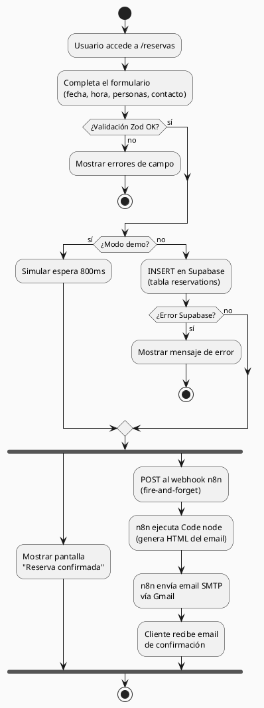
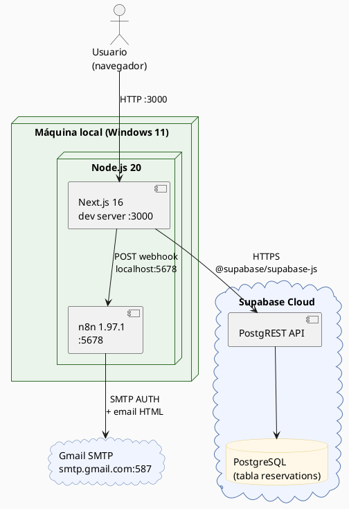
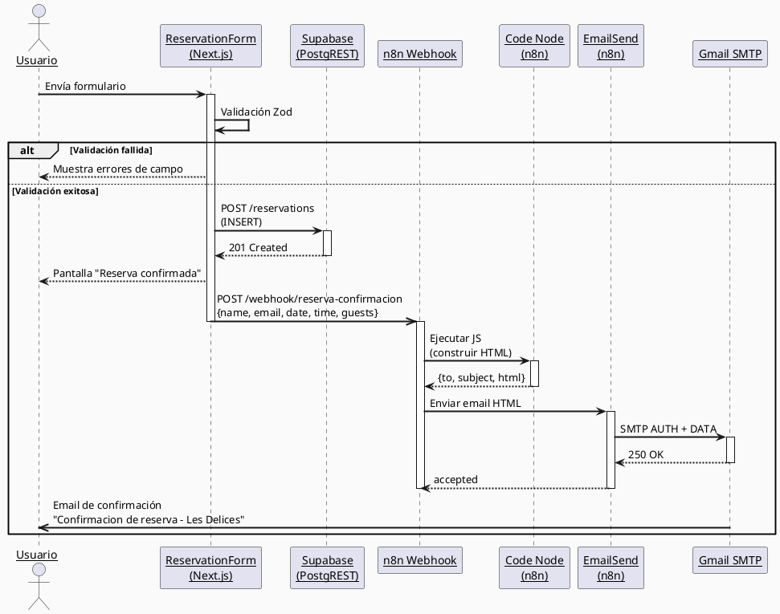
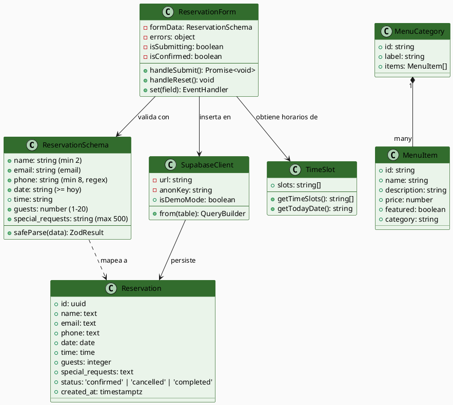

# Les Délices — Sitio Web del Restaurante

Sitio web de alta gama para el restaurante **Les Délices** ubicado en Punta del Este, Uruguay.  
Permite consultar la carta, hacer reservas online con confirmación por email y visualizar información del local.

---

## Índice

1. [Inicio rápido](#inicio-rápido)
2. [Iniciar n8n](#iniciar-n8n)
3. [Pruebas con Postman](#pruebas-con-postman)
4. [Tecnologías y fundamentación](#tecnologías-y-fundamentación)
5. [Arquitectura del proyecto](#arquitectura-del-proyecto)
6. [Diagramas PlantUML](#diagramas-plantuml)

---

## Inicio rápido

### Requisitos previos

- Node.js 20+
- npm 10+
- n8n instalado globalmente (`npm install -g n8n`)
- Cuenta en [Supabase](https://supabase.com) con proyecto creado
- Cuenta de Gmail con verificación en 2 pasos y contraseña de aplicación generada

### 1. Instalar dependencias

```bash
cd les-delices
npm install
```

### 2. Configurar variables de entorno

Copiar el archivo de ejemplo y completar los valores:

```bash
copy .env.local.example .env.local
```

Editar `.env.local`:

```env
NEXT_PUBLIC_SUPABASE_URL=https://<tu-proyecto>.supabase.co
NEXT_PUBLIC_SUPABASE_ANON_KEY=<tu-anon-key>
NEXT_PUBLIC_N8N_WEBHOOK_URL=http://localhost:5678/webhook/<workflow-id>/webhook/reserva-confirmacion
```

> Si no se configuran las variables de Supabase, el sitio funciona en **modo demo** (las reservas no se guardan en la base de datos).

### 3. Crear la tabla en Supabase

Ejecutar el contenido de `supabase/schema.sql` en el **SQL Editor** de Supabase.

### 4. Iniciar el servidor de desarrollo

```bash
npm run dev
```

El sitio estará disponible en [http://localhost:3000](http://localhost:3000).

### 5. Build para producción

```bash
npm run build
npm start
```

---

## Iniciar n8n

n8n gestiona el envío automático de emails de confirmación de reservas vía SMTP.

### Iniciar el servidor

```bash
n8n start
```

Acceder al panel en [http://localhost:5678](http://localhost:5678).

### Configurar el workflow de confirmación

1. En n8n, ir a **Credentials** y crear una credencial de tipo **SMTP** con los datos:
   - Host: `smtp.gmail.com`
   - Puerto: `587`
   - Usuario: tu dirección de Gmail
   - Contraseña: la contraseña de aplicación de Google

2. Crear el workflow **"Les Delices - Confirmacion de Reserva"** con tres nodos:

   ```
   Webhook (POST /reserva-confirmacion)
       ↓
   Code (construye el HTML del email con JavaScript)
       ↓
   Email Send (envía el email vía SMTP)
   ```

3. Activar el workflow desde el toggle de la UI.

4. Copiar la **Production URL** del nodo Webhook y pegarla en `.env.local` como `NEXT_PUBLIC_N8N_WEBHOOK_URL`.

> **Importante:** activar el workflow siempre desde la interfaz de n8n (toggle UI), no solo desde la API, para que el webhook quede registrado en memoria.

### Detener n8n

Presionar `Ctrl+C` en la terminal donde está corriendo.

---

## Pruebas con Postman

Variables de entorno recomendadas en Postman:

| Variable | Valor |
|---|---|
| `SUPABASE_URL` | `https://qnppqrmclylllagjzqov.supabase.co` |
| `SUPABASE_KEY` | `sb_publishable_UKi7bly3jLXYEU2uAa9ngw_fComIEDJ` |
| `N8N_WEBHOOK` | `http://localhost:5678/webhook/z7tMEsQh4VnFvvLr/webhook/reserva-confirmacion` |

---

### Supabase — Reservas

| # | Nombre | Método | URL | Headers | Body (JSON) | Respuesta esperada |
|---|---|---|---|---|---|---|
| 1 | Crear reserva | `POST` | `{{SUPABASE_URL}}/rest/v1/reservations` | `apikey: {{SUPABASE_KEY}}`<br>`Content-Type: application/json`<br>`Prefer: return=representation` | `{"name":"Ana García","email":"ana@mail.com","phone":"+598 99 111 222","date":"2026-06-15","time":"20:00","guests":3,"special_requests":"Sin gluten"}` | `201 Created` — array con la reserva creada |
| 2 | Listar todas las reservas | `GET` | `{{SUPABASE_URL}}/rest/v1/reservations?select=*&order=created_at.desc` | `apikey: {{SUPABASE_KEY}}` | — | `200 OK` — array de reservas |
| 3 | Buscar por email | `GET` | `{{SUPABASE_URL}}/rest/v1/reservations?email=eq.ana@mail.com&select=*` | `apikey: {{SUPABASE_KEY}}` | — | `200 OK` — reservas del email |
| 4 | Buscar por fecha | `GET` | `{{SUPABASE_URL}}/rest/v1/reservations?date=eq.2026-06-15&select=*` | `apikey: {{SUPABASE_KEY}}` | — | `200 OK` — reservas del día |
| 5 | Filtrar por estado | `GET` | `{{SUPABASE_URL}}/rest/v1/reservations?status=eq.confirmed&select=*` | `apikey: {{SUPABASE_KEY}}` | — | `200 OK` — reservas confirmadas |
| 6 | Cancelar reserva | `PATCH` | `{{SUPABASE_URL}}/rest/v1/reservations?id=eq.<uuid>` | `apikey: {{SUPABASE_KEY}}`<br>`Content-Type: application/json` | `{"status":"cancelled"}` | `204 No Content` |
| 7 | Eliminar reserva | `DELETE` | `{{SUPABASE_URL}}/rest/v1/reservations?id=eq.<uuid>` | `apikey: {{SUPABASE_KEY}}` | — | `204 No Content` |
| 8 | Contar reservas por fecha | `GET` | `{{SUPABASE_URL}}/rest/v1/reservations?date=eq.2026-06-15&select=count` | `apikey: {{SUPABASE_KEY}}`<br>`Prefer: count=exact` | — | `200 OK` + header `Content-Range` con el total |

---

### n8n — Webhook de confirmación

| # | Nombre | Método | URL | Headers | Body (JSON) | Respuesta esperada |
|---|---|---|---|---|---|---|
| 9 | Enviar email de confirmación | `POST` | `{{N8N_WEBHOOK}}` | `Content-Type: application/json` | `{"name":"Ana García","email":"ana@mail.com","phone":"+598 99 111 222","date":"2026-06-15","time":"20:00","guests":3,"special_requests":"Sin gluten"}` | `200 OK` — `{"message":"Workflow was started"}` |
| 10 | Sin solicitudes especiales | `POST` | `{{N8N_WEBHOOK}}` | `Content-Type: application/json` | `{"name":"Carlos López","email":"carlos@mail.com","phone":"+598 99 333 444","date":"2026-06-20","time":"13:00","guests":2,"special_requests":""}` | `200 OK` — email enviado sin fila de solicitudes |

---

### Casos de validación — Supabase

| # | Nombre | Método | URL | Body (JSON) | Respuesta esperada |
|---|---|---|---|---|---|
| 11 | Guests fuera de rango (0) | `POST` | `{{SUPABASE_URL}}/rest/v1/reservations` | `{"name":"Test","email":"t@t.com","phone":"099","date":"2026-06-15","time":"20:00","guests":0}` | `400` — violación constraint CHECK (guests BETWEEN 1 AND 20) |
| 12 | Guests fuera de rango (21) | `POST` | `{{SUPABASE_URL}}/rest/v1/reservations` | `{"name":"Test","email":"t@t.com","phone":"099","date":"2026-06-15","time":"20:00","guests":21}` | `400` — violación constraint CHECK |
| 13 | Status inválido | `POST` | `{{SUPABASE_URL}}/rest/v1/reservations` | `{"name":"Test","email":"t@t.com","phone":"099","date":"2026-06-15","time":"20:00","guests":2,"status":"pendiente"}` | `400` — violación constraint CHECK (status IN ...) |
| 14 | Campo requerido faltante | `POST` | `{{SUPABASE_URL}}/rest/v1/reservations` | `{"name":"Test","email":"t@t.com"}` | `400` — NOT NULL violation |

---

> **Tip Postman:** importá las variables como un Environment llamado `Les Délices` y marcalo como activo. Así todos los requests comparten la misma base URL y key sin repetirlas.

---

## Tecnologías y fundamentación

### Next.js 16.2.6 + React 19

**Por qué:** Next.js con App Router permite renderizado del servidor (SSR/SSC) para páginas como la carta y el home, mejorando el SEO y la velocidad de carga inicial. Los componentes interactivos (`ReservationForm`, `Navbar`, `MenuClientNav`) se marcan con `'use client'` para ejecutarse en el navegador. Se utiliza JavaScript puro (sin TypeScript) para mantener la base de código simple y accesible.

### Tailwind CSS v4

**Por qué:** Tailwind v4 introduce un sistema de diseño basado en CSS nativo con `@theme` en lugar de `tailwind.config.js`, lo que reduce la configuración y mejora la integración con el build de Next.js. Los colores de marca (`#326c2d` verde esmeralda y `#E1C872` dorado) se definen como variables CSS custom en `globals.css`.

### Supabase (PostgreSQL + PostgREST)

**Por qué:** Supabase ofrece una base de datos PostgreSQL gestionada con una API REST generada automáticamente, autenticación y Row Level Security (RLS). Para este proyecto se utiliza para persistir las reservas. La integración con `@supabase/supabase-js` permite operaciones desde el cliente sin necesidad de un backend propio.

### Zod v4

**Por qué:** Zod permite definir esquemas de validación con tipado fuerte en JavaScript. El esquema de reserva valida nombre, email, teléfono, fecha (no pasada), horario y cantidad de personas antes de enviar al servidor. Esto implementa la heurística de Nielsen **#5 (Prevención de errores)**, informando al usuario antes de que ocurra un error de base de datos.

### n8n

**Por qué:** n8n es una plataforma de automatización de flujos de trabajo de código abierto. Se utiliza para desacoplar el envío de emails del proceso de reserva: cuando el formulario guarda la reserva en Supabase, llama al webhook de n8n en segundo plano (fire-and-forget). Esto significa que si el email falla, la reserva igual se registra. El nodo Code permite generar el HTML del email con JavaScript real, evitando limitaciones del sistema de templates de n8n.

### Gmail SMTP (via contraseña de aplicación)

**Por qué:** Gmail SMTP con contraseña de aplicación es una solución gratuita, confiable y sin límites de dominio verificado para el volumen de un restaurante. No requiere configuración de DNS (SPF/DKIM) ni cuentas en servicios de email transaccional de pago como SendGrid o Resend.

---

## Arquitectura del proyecto

```
ProyectoMadera/
└── les-delices/
    ├── app/
    │   ├── globals.css          # Tailwind v4 + @theme con colores de marca
    │   ├── layout.js            # Layout raíz: fuentes Playfair Display + Lato
    │   ├── page.js              # Home: hero, features, platos destacados, mapa
    │   ├── menu/
    │   │   └── page.js          # Carta completa con nav sticky por categorías
    │   └── reservas/
    │       └── page.js          # Página de reservas + FAQ
    ├── components/
    │   ├── Navbar.js            # Navegación responsiva ('use client')
    │   ├── Footer.js            # Pie de página
    │   ├── ReservationForm.js   # Formulario multi-sección ('use client')
    │   └── MenuClientNav.js     # Nav sticky con IntersectionObserver ('use client')
    ├── lib/
    │   ├── supabase.js          # Cliente Supabase con fallback a modo demo
    │   └── validations.js       # Esquema Zod + generador de horarios disponibles
    ├── data/
    │   └── menu.js              # Carta completa organizada en 13 categorías
    └── supabase/
        └── schema.sql           # DDL de la tabla reservations + políticas RLS
```

---

## Diagramas PlantUML

### Diagrama de Flujo — Proceso de Reserva



---

### Diagrama de Despliegue



---

### Diagrama de Secuencia — Reserva con Confirmación de Email



---

### Diagrama de Clases — Modelo de Datos y Módulos



---

> **Nota sobre n8n:** el servidor de n8n debe estar corriendo localmente para que los emails de confirmación funcionen. El sitio opera con normalidad sin n8n — solo no se envían emails.
